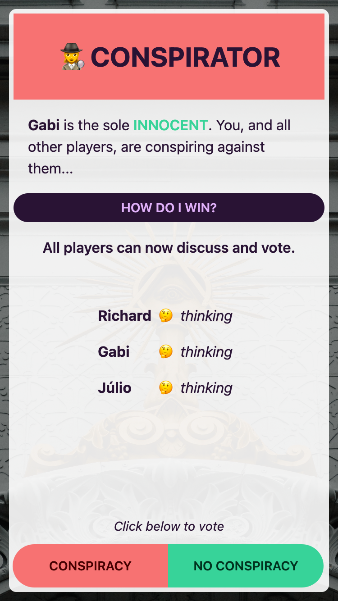
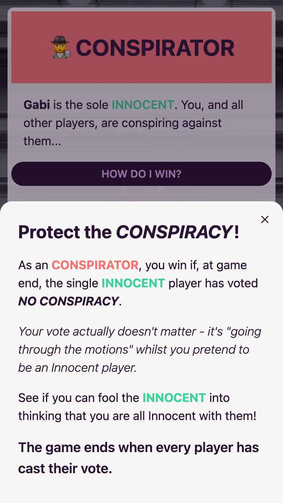
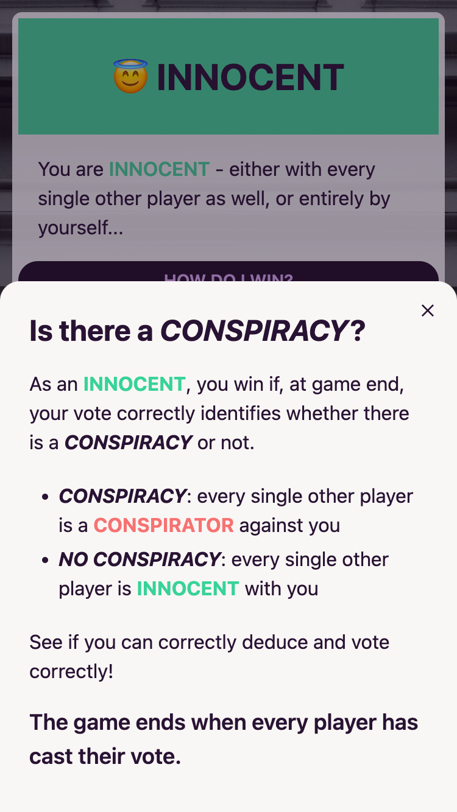
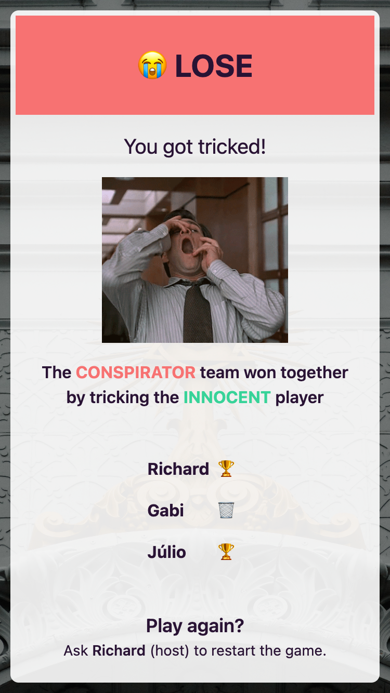

# Conspiracy

  
  
  
  

[Conspiracy](https://wiki.mafiascum.net/index.php?title=Conspiracy) is a quick-play social game of deception, deduction and paranoia for three or more players..

It is for **3-10 players**, and a game might take **~2 minutes** (but it can be *as little as 30 seconds*).

This repo is is a web app implementation of it, primarily intended for use on group video calls.
